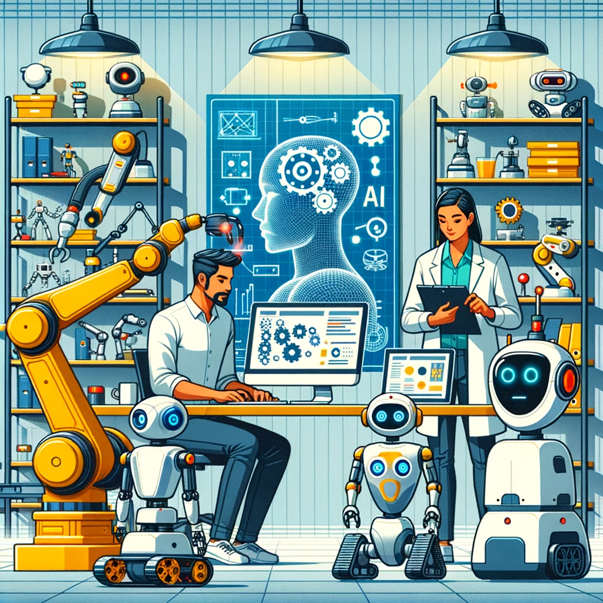

# CogControl

---

## Home

Welcome to our Cognitive Robotics Research Team website! Here, we aim to push the boundaries of robotics and artificial intelligence. Explore the page to learn more about our groundbreaking projects and incredible team.

---

## NeuroSym Robotics

### Description
Imagine speaking to a robot as naturally as you speak to a friend, and watching it carry out complex tasks flawlessly. Welcome to our groundbreaking research, where we're breaking the language barrier between humans and machines. By leveraging the power of Natural Language Processing (NLP), we're transforming everyday conversations into Precise Descriptive Declarative Language (PDDL) that robots understand. Forget tedious coding or complicated interfaces; command your robotic assistant simply by talking to it! We're revolutionizing the way robotic tasks are planned and executed, all through the power of Large Language Models.

### Goals
- Making robots 'see and understand' your commands, not just hear them.
- Turning Boston Dynamics' SPOT into your smartest, most visually-aware assistant yet.

### Motivation
Uniting the intelligence of neural networks with the precision of symbolic AI, our research is paving the way for faster, more reliable robotic systems. By making it simpler for humans to create plans for robots, we're opening doors to life-changing applications—from disaster relief and defense strategies to smarter homes. Our ultimate goal? Democratizing robotics to make advanced technology accessible to everyone.

---

## Project 2
<!------>

### Description
Project 2 focuses on [Brief Description].

### Goals
- Goal 1
- Goal 2

### Motivation
Our main motivation is [Motivation].

---

## Project 3
<!------>

### Description
Project 3 focuses on [Brief Description].

### Goals
- Goal 1
- Goal 2

### Motivation
Our main motivation is [Motivation].

---

## About Us
<!---

  
  

--->

- **B. ing. Nicholas Massad**: Trained in Electrical Engineering with a focus on Artificial Intelligence at the University of Sherbrooke, Nicholas Massad values the intersection of theory and practical application. This was demonstrated in a collaborative effort to design a hybrid gas-powered drone, optimized for challenging conditions.

A believer in teamwork and shared visions, Nicholas Massad contributed to restarting the Rocket project at the University of Sherbrooke **CASUS**, which led to a collective participation in the Spaceport competition in 2019.

Beyond engineering, Nicholas's academic journey includes explorations into Physics which led to his interest in electrical engineering and an 3 year experience with Biotechnology during his cegep years. This varied background has been instrumental in approaching challenges with a multidisciplinary lens.

At BRP, Nicholas Massad had the opportunity to work with a dedicated team on sales forecasting, leveraging machine learning to support data-driven decisions. Which he followed up with 2 amazing interships at Levio, where he developped new approaches to algorithmic planning.

Currently pursuing a master's in AI at the University of Sherbrooke, Nicholas Massad is keen on learning, sharing, and collaborating to contribute meaningfully to the broader AI and robotics community.

- **B. Sc. Léo Chartrand**: Léo Chartrand completed his comupter science studies at Université de Sherbrooke. Fueled by a thirst for knowledge, he dedicated his last semester to pursuing several advanced courses on AI, two of which are normally reserved for graduate students, covering NLP, Deep Learning and Reinforcement Learning. Léo also had the opportunity to work on a few projects that delve into imitation learning, simulation and parallel computing.

  During his studies, Léo Chartrand had the privilege to work as a Software Analyst at the **Ministère de l'Agriculture, des Pêcheries et de l'Alimentation du Québec**, where he supervised the development of new features for the laboratory information management system, which is used for epidemio-surveillance throughout the province.

  Now working with the CogControl team, Léo strives to push research on AI, exploring innovative approaches that could lead to genuine reasoning and contribute to the ever growing field of artificial intelligence.

- **Team member #3**: 
